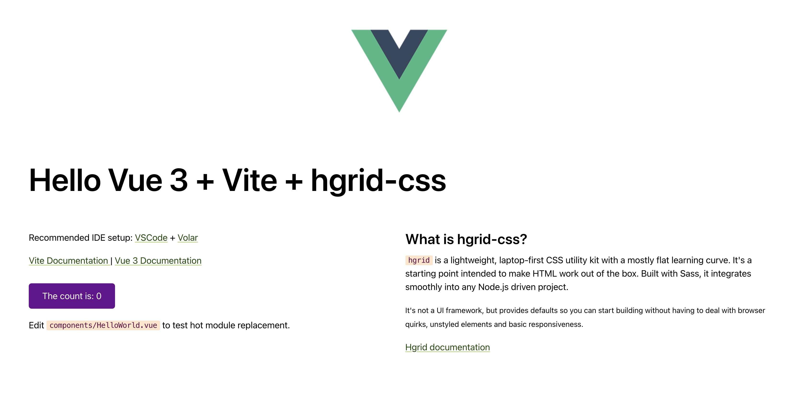

# Integrating [hgrid-css](https://github.com/ahansson/hgrid-css) in a Vue 3 project with Vite

<p></p>

## Hgrid Documentation
https://hgrid.io/documentation/integrate/#vue

## Repository
https://github.com/ahansson/hgrid-css-vue-vite

Minimal setup of Vue with Sass compilation for `hgrid-css`.

## What is hgrid-css ?

A lightweight and practical CSS utility kit with zero config and a flat learning curve.

Repo: https://github.com/ahansson/hgrid-css

## Installation

Installs the required `node_modules`, including `hgrid-css`.

```bash
npm install
```

## Development

Starts the development server with Sass compilation for **hgrid** and serves your site from the `public` folder on localhost:3000 (if available).

```bash
npm run dev
```

## Build

```bash
npm run build
```
Also check the (general) tips on [reducing the output size](https://hgrid.io/documentation/production/) of your CSS.

## Template Setup

The template uses Vue 3 `<script setup>` SFCs, check out the [script setup docs](https://v3.vuejs.org/api/sfc-script-setup.html#sfc-script-setup) to learn more.

## Recommended IDE Setup

- [VSCode](https://code.visualstudio.com/) + [Volar](https://marketplace.visualstudio.com/items?itemName=johnsoncodehk.volar)
